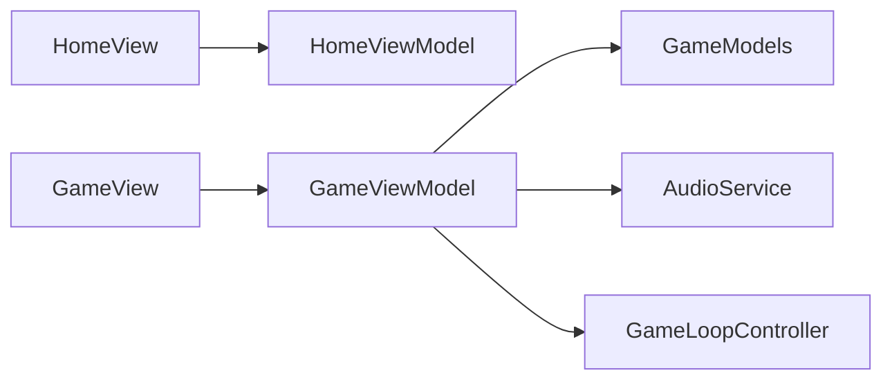

# Emoji Dodge

A minimal SwiftUI iOS game: dodge falling emojis, survive for a higher score. Built with **MVVM**, a **`CADisplayLink`** game loop, and **AudioToolbox** system sounds (no bundled audio files).

## Requirements

- Xcode 15 or later (tested with Xcode 16+)
- iOS **17.0+**
- Swift 5.9+

## How to run

1. Open `EmojiDodge.xcodeproj` in Xcode.
2. Select an **iPhone** simulator (or device).
3. Build and run (**⌘R**).

Command-line build (writes `DerivedData` next to the project):

```bash
cd "/path/to/Emoji Dodge "
xcodebuild -project EmojiDodge.xcodeproj -scheme EmojiDodge \
  -destination 'generic/platform=iOS Simulator' \
  -derivedDataPath ./DerivedData build
```

Set your **Team** in the target **Signing & Capabilities** tab if you run on a physical device.

## Architecture



| Layer | Role |
|--------|------|
| **Views** | Layout, `NavigationStack`, `DragGesture`, overlays only. |
| **ViewModels** | `ObservableObject` state, rules, loop callbacks. |
| **Models** | Structs and enums (`FallingEmoji`, `GamePhase`, `GameConfig`). |
| **Services** | `GameLoopController` (`CADisplayLink`), `SystemSoundAudioService` (`AudioServicesPlaySystemSound`). |

Gameplay logic (spawn, movement, collision, score) lives in **`GameViewModel`**, not in views.

**Controls:** drag moves the pilot on **both axes** within safe margins. **Pilot emoji** is chosen on the home screen (`PlayerPilotPicker` + `AppStorage`) and read in **`GameView`** via `PlayerCustomization`.

## UI and design system

Visual layer only (game rules unchanged):

- **[`DesignSystem/AppTheme.swift`](EmojiDodge/DesignSystem/AppTheme.swift)** — spacing, corner radii, **light/dark gradients** (home, playfield, primary buttons, HUD accent, impact flash).
- **[`DesignSystem/HapticFeedback.swift`](EmojiDodge/DesignSystem/HapticFeedback.swift)** — light / medium / soft `UIImpactFeedbackGenerator` taps.
- **[`UI/AnimationModifiers.swift`](EmojiDodge/UI/AnimationModifiers.swift)** — `PressScaleButtonStyle`, optional shake / stagger helpers.
- **[`UI/ChromeViews.swift`](EmojiDodge/UI/ChromeViews.swift)** — `GradientBackground`, `GlassCard`, `ScoreHUD` (time + run score + all-time best), `GameNavBackButton`, `PlayerPilotPicker`, gradient / outline button labels, `GameOverPanel`, `HomeFloatingEmojis`.

**Home** uses a full-screen gradient, glass instructions card, staggered hero + content entry, bobbing emoji row, and a gradient **Start Game** `NavigationLink` with press scale + haptic.

**Game** uses a soft playfield gradient, **HUD** with time + run **Score** + **all-time best**, `interactiveSpring` on the player, scale bounce while dragging (`@GestureState`), per-emoji spawn pop + fall rotation + shadow (visual only), red **impact flash** + horizontal **shake** on game over, and a **material + glass** modal with **Play Again** / **Back to Home**.

## Score

- **Time**: whole **seconds survived** (floor of elapsed time since the round started).  
- **Score** (run): emojis that **leave the bottom** of the playfield without colliding — incremented in **`GameViewModel`** as `emojiScore` when off-screen emojis are cleared.  
- **All-time best score**: maximum run **Score** ever achieved, stored in **`UserDefaults`** via [`HighScorePersistence`](EmojiDodge/Features/Game/GameModels.swift) (`emojiDodge.allTimeHighEmojiScore`). Updated on game over; shown on **home**, in the **HUD**, and on the **game over** panel (with **New record!** when applicable).

## Sound

- **Gameplay**: A low-frequency **timer** plays a subtle system sound (`SystemSounds.gameplayTick`) while the round is active. iOS does not provide looping BGM through system sounds; this matches the “background feedback” requirement without asset files.
- **Game over**: One-shot system sound (`SystemSounds.collision`).
- IDs are defined in `SystemSounds` in [`EmojiDodge/Features/Game/GameModels.swift`](EmojiDodge/Features/Game/GameModels.swift); change them there to tune feel per device/OS.

## Project layout

```
EmojiDodge.xcodeproj
EmojiDodge/
  EmojiDodgeApp.swift
  AppRoute.swift
  DesignSystem/    AppTheme, HapticFeedback
  UI/              AnimationModifiers, ChromeViews (HUD, buttons, panels)
  Features/
    Home/          HomeView, HomeViewModel
    Game/          GameView, GameViewModel, GameModels
  Services/        GameLoopController, AudioService
  Resources/       Assets.xcassets
README.md
prompt.md
PROMPTS.md
TOOLS.md
```

## App icon

`AppIcon` is a placeholder (1024 slot, no image). Add your own in **Assets.xcassets** before App Store submission.
